# Creating a receipt and webhook notification with Commerce.js

This guide explains how to create a receipt page along with using webhooks provided by Commerce.js and the Chec Dashboard. 

[Live demo for this Guide: "***Creating a receipt and webhook notification***"](https://seities-store-cjs-react-guide.netlify.com/)

****** *Note* ******

* *This guide is using v2 of the SDK*
* *The Live Demo is best viewed on Desktop (**responsiveness limited**)*
* *This is a continuation of a previous guide - [Single page checkout](https://single-page-checkout-cjs.netlify.com/)*

**********

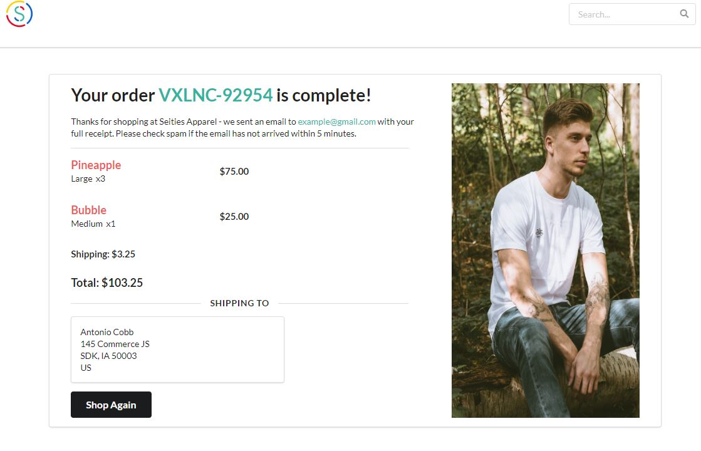

## Overview
After I capture a checkout and processed the payment, I now want to provide some confirmation of purchase to the customer.  Thankfully the Commerce.js SDK (post capture) provides all the data needed in order to curate a 'receipt' or conformation page.  I will be using that data to display to the customer some of the order details and shipping info.  Lastly I will incorporate webhooks provided by Commerce.js via the Chec Dashboard to help send a Slack notification that a new order has been placed! Let's get started ... 

#### This guide will cover: 

1. Saving receipt info to local storage
2. Retrieving receipt data for display
3. Add private route & removing data from local storage
4. Setup URL to receive webhook payload
5. Add webhook in Chec Dashboard
6. Send notification message to Slack channel

### Requirements/Prerequisites

- [ ] IDE of your choice (code editor)
- [ ] [NodeJS](https://nodejs.org/en/), or [yarn](https://classic.yarnpkg.com/en/docs/install/#windows-stable) → npm or yarn.
- [ ] Some knowledge of Javascript & React
- [ ] Some knowledge of [webhooks](https://sendgrid.com/blog/whats-webhook/)
- [ ] *Bonus* - Using [React Hooks](https://reactjs.org/docs/hooks-reference.html) - specifically `useState()`
- [ ] *Bonus* - [React Router](https://reacttraining.com/react-router/web/api/Route)
- [ ] *Bonus* - [Node/Express](c)
- [ ] *Bonus* - [Slack API - webhooks](https://slack.com/help/articles/115005265063-Incoming-Webhooks-for-Slack)
- [ ] *Bonus* - familiarity with the framework [Semantic UI (react) library](https://react.semantic-ui.com/)

## Getting Started

### STEP 1. Saving Receipt Info to Local Storage:

The SDK used to provide a helper function you could pass the checkout token and get the receipt info - unfortunately that function is no longer live &#128532;.  This is because under the hood, the function hit an endpoint that required your secret key.  The SDK only utilizes helper functions with your public API key.  

No worries &#128515; - you can make use of the browser's local storage as a way to save data.  Let's take a look at the response from capturing a checkout:   

<p align="center">
  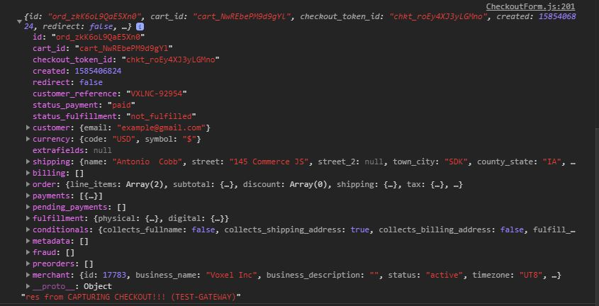
</p>

As you can see this entire response is essentially the cutomer receipt.  Inside the `then()` function connected to our `commerce.checkout.capture()` - I can save this data to [local storage](https://developer.mozilla.org/en-US/docs/Web/API/Window/localStorage): 

```javascript
// *** CheckoutForm.js ***
commerce.checkout.capture(props.tokenId, final)
    .then(res => {
            props.setReceipt(res)
            localStorage.removeItem('cart-id')
            localStorage.setItem('receipt', JSON.stringify(res))
            history.push(`/order-complete/${props.tokenId}/${res.id}`)
            setProcessing(false)
    })
```
*** *Note *** You must **[stringify](https://developer.mozilla.org/en-US/docs/Web/JavaScript/Reference/Global_Objects/JSON/stringify)** the response object when adding to local storage*

```
localStorage.setItem('receipt', JSON.stringify(res))
```

**A quick recap of what's happening post capture:** 
- `props.setReceipt(res)` triggers a call on the homepage to update cart info
- `localStorage.removeItem('cart-id')` removes cart-id for routing logic
- `localStorage.removeItem('cart-id')` ***new* - adding receipt data to local storage**
- ``history.push(`/order-complete/${props.tokenId}/${res.id}`)`` routing the customer to the conformation page
- `setProcessing(false)` logic trigger for displaying cart icon

#### Checking Local Storage for data

Now that I've added the data to local storage, let's check to make sure it is there.  Go to your browser and inspect your page.  The inspect window will have tabs and you should locate the **`Application`** tab.  From there you will see a **`Local Storage`** dropdown with a specific domain. Click the domain and you will see a list of all objects stored in local storage:

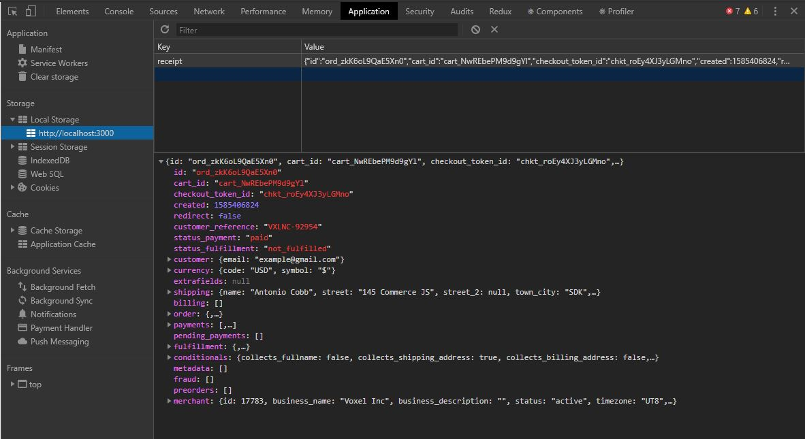

I can confirm local storage has the proper information with the key set to '`receipt`'.  It is important to note this data will always be stored in the browser until it is either manual deleted or removed in code (*I'll cover this later* &#129488;).  I can now access this data anywhere in my app! Let's see about retrieving ...

### Step 2. Retrieving Receipt Data for Display

Accessing the data in local storage is as straightforward as putting it in local storage.  You just use `localStorage.getItem()` and pass it a `key`: 

```javascript
// *** CheckoutComplete.js ***
const receipt = JSON.parse(localStorage.getItem('receipt'))
```

Just as you needed to **`stringify`** previsouly - you also must use [`JSON.parse()`](https://developer.mozilla.org/en-US/docs/Web/JavaScript/Reference/Global_Objects/JSON/parse) in order to get the data into a format needed to utilize the data.  You can log the '`receipt`' variable and you will see it's identical to the response we logged post capture.  

#### The `<CheckoutComplete />` component

It is time to update the `<CheckoutComplete />` component with all the useful data a customer would like to see after completing a purchase.  Now that you have a variable that contains everything, let's initialize state with the new data: 

```javascript
// *** CheckoutComplete.js ***

// Parsing local storage data
const receipt = JSON.parse(localStorage.getItem('receipt'))

// Initializing state with our local storage data
const [customerReceipt, setCustomerReceipt] = useState(receipt)
```

Once initialized, you can now use the state object to render whichever customer data you choose.  Again this portion is completely up to you, but here's an example of some of the data one can show: 

<p align="center">
  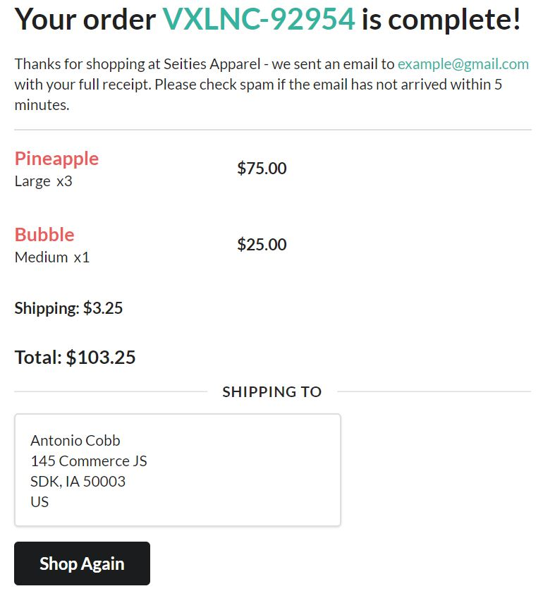
</p>

```javascript
// *** CheckoutComplete.js ***
return (
<>
    <Segment className='order-complete'>
        <div>
            <h1>Your order <span>{customerReceipt.customer_reference}</span> is complete!</h1>
            <p>
                Thanks for shopping at Seities Apparel - we sent an email to <span>{customerReceipt.customer.email}</span> with your full receipt. Please check spam if the email has not arrived within 5 minutes. 
            </p>
            <Divider className='divide'/>
            <section>
                {customerReceipt.order.line_items.map(item => (
                    <Container className='item-data-container' key={item.id}>
                        <CheckoutItems item={item}/>
                    </Container>
                ))}
            </section>
            <Header size='small'>
                Shipping: {customerReceipt.order.shipping.price.formatted_with_symbol}
            </Header> 
            <Header>
                Total: {customerReceipt.order.total.formatted_with_symbol}
            </Header> 
            <Divider className='divide' horizontal>Shipping To</Divider>       
            <Segment>
                {customerReceipt.shipping.name}  <br />
                {customerReceipt.shipping.street}  <br />
                {customerReceipt.shipping.street_2 && (
                    <>
                    {customerReceipt.shipping.street_2}
                    <br />
                    </>
                )}  
                {customerReceipt.shipping.town_city}, {customerReceipt.shipping.county_state} {customerReceipt.shipping.postal_zip_code}  <br />
                {customerReceipt.shipping.country} 
            </Segment>
            <Link to='/'>
                <Button secondary size='large' onClick={removeReceipt}>Shop Again</Button>
            </Link>
        </div>
        <Image src={img} size='medium' />
    </Segment>
</>
);
```

As you can see, this portion is all about taking the data given and displaying it however you see fit.  

### Step. 3 Add Private Route & Removing Data from Local Storage

I've completed the component that will display information for the customer - now what &#129335;!? I want this information displayed as long as the customer hasn't navigated away - either by pressing **back** or clicking **shop again** button.  

Once the customer navigates away, they should **NOT** be able to return and still render the receipt info.  

#### Private Route for the `<CheckoutComplete />` component

In order to achieve this I will setup a private route to the `<CheckoutComplete />` component that only renders if the '`receipt`' object is stored in local storage: 

```javascript
// *** PrivateRouteReceipt.js ***
const PrivateRoute = ({ component: Component, ...rest }) => {
	
	return <Route {...rest} render={(props) => {

		if(localStorage.getItem('receipt')) {
			return <Component {...props} {...rest}/>
		}
		
		else {
			return <Redirect to="/" />
		}

	}} />
}
```

This function checks to see if **'`receipt`'** exist in local storage - if `true`, the function will return the `<CheckoutComplete />` component; if `false` the customer will be redirected to home (`to="/"`). 

Let's add this private route to our `<CheckoutComplete />` component: 

```javascript
// *** App.js ***
<PrivateRouteReceipt 
    component={CheckoutComplete}
    path={`/order-complete/:checkoutToken/:orderId`}
    setCheckout={setCheckout} 
/>
```

#### Removing from local storage

The last step is to actually remove the data from local storage.  As mentioned, once the customer navigates from the page, they should not be able to navigate back again.  

One obvious place to remove data from local storage is when `shop again` button is clicked.  I created a function that does this: 

```
<Link to='/'>
    <Button secondary size='large' onClick={removeReceipt}>Shop Again</Button>
</Link>
```
```
const removeReceipt = () => {
    localStorage.removeItem('receipt')
}
```

Once clicked, `removeReceipt()` will delete the key **'`receipt`'** from local storage.  Because of the private route created, the customer will not be able to navigate back to the conformation page.  

Now - let's access what happens when a customer presses back.  The previous page is the checkout page which displays cart info and a form to capture a checkout.  I already have another private route setup to check if the **'`cart-id`'** key is in local storage - if `false` the customer will NOT be able to view the checkout page (***because that cart has already been emptied based on a successfully capture***) and will be routed home.

I now need to remove the **'`receipt`'** object (*from local storage*) whenever the `<ProductContainer />` component is loaded. Whenever the `<ProductContainer />` component is rendered (***which is essentially our home page***), there should **NEVER** be a **'`receipt`'** object in local storage.  I can simply add the removal in the `useEffect()` to always delete the desired key upon every render: 

```javascript
// *** ProductContainer.js ***
useEffect(() => {
    commerce.products.list()
        .then(res => {
        setProducts(res.data)
        })
        .catch(err => console.log(err))

        props.setCheckout(false)
        localStorage.removeItem('receipt') //Added to remove key from LS
},[])
```

These actions ensure the customer will **ONLY** have access to the receipt info **UNTIL** they navigate elsewhere.  Okie dokie! That pretty much sums up handling the receipt info along with proper navigation logic.  The next steps pertain to setting up and configuring webhooks &#128526;. 

*** ***Note** *** In order to proceed, you will need to have some knowledge about setting up a server along with handling http request.*

### Step 4. Setup URL to Receive Webhook Payload

Commerce.js has recently added webhook functionality within the Chec Dashboard.  This means as a developer you can select among many actions/events that when triggered will send specific data associated with that event to a specified URL.  Some actions include: 

- When a checkout capture occurs
- Whenever an order gets fulfilled
- Once a new product is created

<p align="center">
  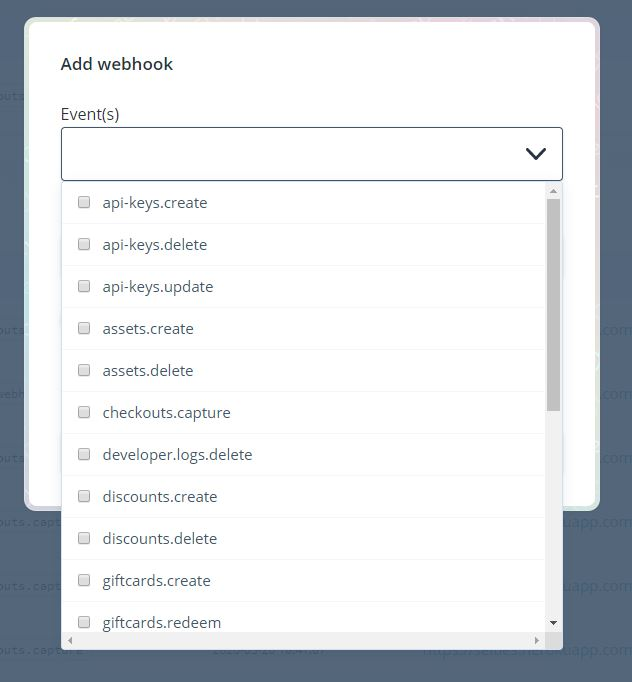
</p>

As you can see there are many different webhook events you can choose from.  This is very beneficial in that you don't have to ping an endpoint or use the SDK to see about certain data changes.  Once configured, your server will automatically get a notification (***a http post request***) whenever an event takes place.  In this example I will be configuring a webhook event for whenever an order is captured.  

#### Setting up your endpoint

As mentioned previously, you can setup your server using the technology of your choice - I choose to setup a popup server using Node.js:

```javascript
// *** index.js ***
const server = require('./server.js');

const PORT = process.env.PORT || 7500;

server.listen(PORT, () => {
  console.log(`Listening on port ${PORT}...`);
});
```

Further, once my server is setup, I will be using express to handle **`http`** requests.  For the purposes of this example, we only need to create one endpoint that accepts a **`POST`** request: 

```javascript
// *** server.js ***
server.post('/new-order', (req, res) => {

    // Just logging the body of the request
    console.log(req.body, 'data from webhook call')

    // Sending a 200 to show success
    res.status(200).json({message: "success"})
        
})
```
For the moment, this is all that needs to be done.  In the next step I will configure the webhook in the Chec Dashboard with the newly created URL - **`myserver.com/new-order`**

### Step 5. Add Webhook in Chec Dashboard

Now that my endpoint is setup and I'm logging the body (*in order to see what's coming through*), I need to add that URL and configure the webhook from the Chec Dashboard.  Navigate to `Setup` and click the `Webhooks` tab.  Once you're in the `webhooks` menu, click **`+ ADD WEBHOOK`** button: 

<p align="center">
  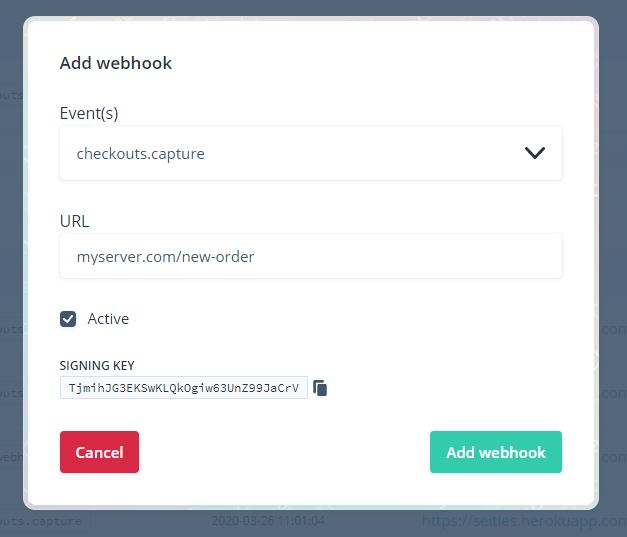
</p>

Finish the process by clicking **`Add webhook`**.  Let's start off by sending a test to my server endpoint.  If you recall we're logging the body so if the test runs successfully, I can see the webhook payload (*another word for data*). Under options click `View details`:

<p align="center">
  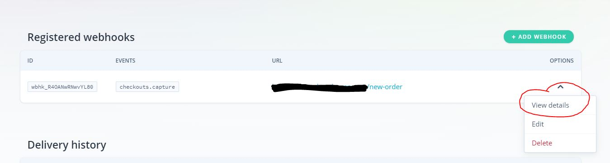
</p>

You will see a button that says **`SEND TEST REQUEST`**.  If configured properly you will see some data logged on your server: 

<p align="center">
  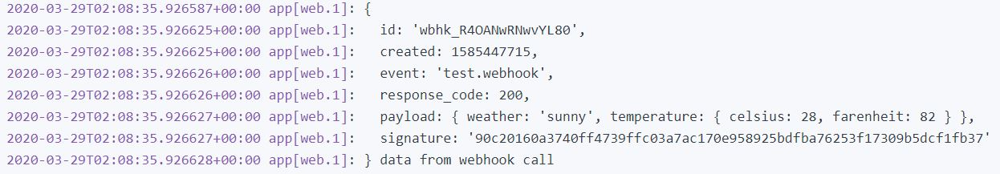
</p>

Because I sent back a *200* status code a green check mark will display if successful: 

<p align="center">
  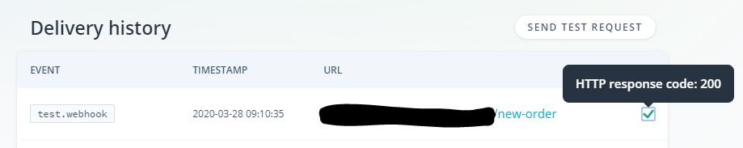
</p>

#### Capture an Order! 

Remember, the ultimate goal is take some data that is sent to your server (***whenever the webhook event is triggered***) - then use the new data to send a notification to Slack.  Before I proceed, let's look at the payload whenever the webhook event is triggered.  All I have to do is capture an order and see the data that gets logged in my server ... 

<p align="center">
  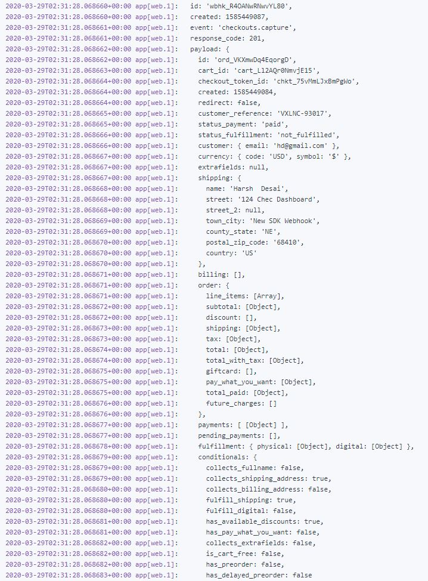
</p>

With further investigation you'll notice this looks a lot like the response returned whenever an order is captured using the SDK helper function! We should take a step back and look at the big picture.  Because of this webhook provided by Commerce.js - whenever an order is captured the system will send that receipt data to the specified URL.  On the server side all I have to do is take that data and perform whatever task needed &#129299;. 

### Step 6. Send Notification Message to Slack Channel

Now that I have the necessary data to compile a notification - I need to decide what to send to Slack.  I don't need everything; but just some important data I would like to be notified about in the event an order has been captured: 

- reference_id
- name
- email
- country
- '#' of items ordered
- order amount

I will [deconstuct](https://developer.mozilla.org/en-US/docs/Web/JavaScript/Reference/Operators/Destructuring_assignment) to get the data needed: 

```
// *** server.js ***

let { customer_reference, customer, shipping, order } = req.body.payload
```

#### Creating the Slack App & Incoming webhook

In the spirit of webhooks - Slack has the ability to add incoming webhooks in order to post messages in a particular Slack workspace.  To achieve this, you **MUST** create a Slack App and give the specified Slack workspace access to the app.  [Here is a step by step!](https://slack.com/help/articles/115005265063-Incoming-Webhooks-for-Slack)

For testing I created a brand new Slack workspace and gave the proper access to my Slack App **"New Order"**.  

<p align="center">
  
</p>

I can now add an incoming webhook via Slack that will generate an URL.  This endpoint when sent a **`POST`** request with message data in the body will automatically post the message in the configured channel.  I set this incoming webhook to post in an ***#ecommerce*** channel created in my FTT Slack workspace. 

<p align="center">
  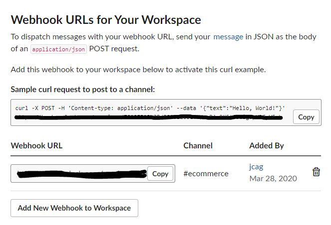
</p>

#### Formatting the Slack message

The Slack API has many ways to format a message and you can find those [HERE](https://api.slack.com/messaging/composing/layouts). I will be using `blocks` and creating an object that will be sent in a `POST` request: 

```javascript
// *** server.js ***
let newOrderMessage = {
    "blocks": [
        {
            "type": "divider"
        },
        {
            "type": "section",
            "text": {
                "type": "mrkdwn",
                "text": "*You have a new order!* :fire:"
            }
        },
        {
            "type": "section",
            "text": {
                "type": "mrkdwn",
                "text": "_Here's some of the order details below:_"
            }
        },
        {
            "type": "section",
            "text": {
                "type": "mrkdwn",
                "text": `*ref #:* ${customer_reference}`
            }
        },
        {
            "type": "section",
            "text": {
                "type": "mrkdwn",
                "text": `*name:* ${shipping.name}`
            }
        },
        {
            "type": "section",
            "text": {
                "type": "mrkdwn",
                "text": `*email:* ${customer.email}`
            }
        },
        {
            "type": "section",
            "text": {
                "type": "mrkdwn",
                "text": `*country:* ${shipping.country}`
            }
        },
        {
            "type": "section",
            "text": {
                "type": "mrkdwn",
                "text": `*total items ordered:* ${order.line_items.length}`
            }
        },
        {
            "type": "section",
            "text": {
                "type": "mrkdwn",
                "text": `*amount:* ${order.total.formatted_with_symbol}`
            }
        },
        {
            "type": "divider"
        }
    ]
}
```

As you can see I simply added the necessary data from the `req.body` to the `newOrderMessage` object.  This object will be sent in the body to the Slack incoming webhook URL provided in developer settings.  

#### Sending message to Slack

The last step is to make an API call to the provided incoming webhook URL along with the message details. 

```javascript
// *** server.js ***
axios.post(process.env.SLACK_WEBHOOK, newOrderMessage)
    .then(res2 => {
        res.status(200).json({message: "success"})
    })
    .catch(err => {
        res.status(400).json({message: err.response.statusText})
    })   
```

If everything is configured properly whenever an order is captured, you will get a Slack notification in the proper Slack channel! 

<p align="center">
  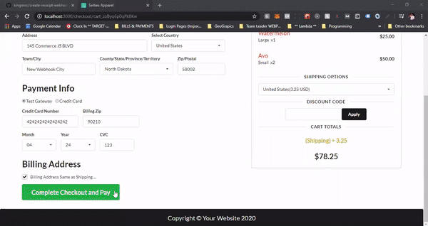
</p>

#### Conclusion 

Hopefully you can now see the power of using webhooks.  Once setup, you can automate a lot of tasks or other actions more efficiently.  Commerce.js suite of webhooks will be very helpful in the building of your eCommerce website.  Instead of relying on one source to confirm a new order, Commerce.js can now send that same 'receipt' data to another server instantly.  You can use this data to send out custom emails or save it to your personal database - Slack notifications are only the beginning.  Here's a final recap!
 
- Added receipt info (*response from order capture*) and setting to local storage
- Used the local storage data to create conformation page for customer
- Added a private route and setup logic so customer can't navigate back to receipt page
- Setup the server and configured endpoint for Commerce.js webhook
- Added webhook in Chec Dashboard and set URL to my configured endpoint
- Parsed payload from Commerce.js webhook and made API call to Slack's incoming webhook URL

This guide is a continuation of a previous guide:
 - [Single page checkout](https://github.com/kingmoc/single-page-checkout-cjs-react) - A step by step showing the process to capture an order.   

[LIVE DEMO](https://seities-store-cjs-react-guide.netlify.com/)

## Built With

* [React.Js](https://reactjs.org/docs/getting-started.html)
* [Semantic-UI](https://react.semantic-ui.com/)
* [Commerce.js (SDK)](https://commercejs.com/docs/)
* [Node/Express](https://single-page-checkout-cjs.netlify.com/)

